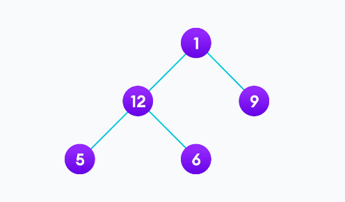

Binary tree is a non-linear data structure. Unlike linear data structures we can traverse the trees in multiple ways. Lets see, How to implement these ways in javascript



# In-order traversal (Left-Root-Right)

```js

```
