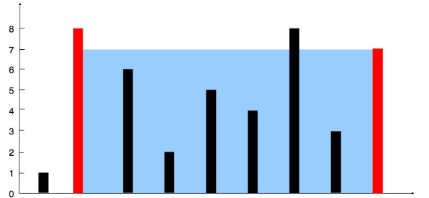

## problem

Given n non-negative integers `a1, a2, ..., an` , where each represents a point at coordinate `(i, ai)`. `n` vertical lines are drawn such that the two endpoints of the line i is at `(i, ai)` and `(i, 0)`. Find two lines, which, together with the x-axis forms a container, such that the container contains the most water.

_Notice_ that you may not slant the container.

### Example 1



```
Input: height = [1,8,6,2,5,4,8,3,7]
Output: 49
Explanation: The above vertical lines are represented by array [1,8,6,2,5,4,8,3,7]. In this case, the max area of water (blue section) the container can contain is 49.
```

for more details about the problem [click here](https://leetcode.com/problems/container-with-most-water/)

## Solution using Brute Force

It might gives an error which is TLE(Time Limit Exceeded)

- Time complexity: O(n^2)
- Space complexity: O(1)

```js
var maxArea = function (height) {
  let area = 0;

  for (let i = 0; i < height.length; i++) {
    for (let j = i + 1; j < height.length; j++) {
      let newArea = min(height[i], height[j]) * (j - i);
      if (newArea > area) {
        area = newArea;
      }
    }
  }
  return area;
};

var min = function (i, j) {
  if (i < j) {
    return i;
  }
  return j;
};
```

## Solution using Two pointer

- Time complexity: O(n)
- Space complexity: O(1)

```js
var maxArea = function (height) {
  let low = 0;
  let high = height.length - 1;
  var area = 0;

  while (low < high) {
    const currArea = (height[low] > height[high] ? height[high] : height[low]) * (high - low);
    area = area < currArea ? currArea : area;

    if (height[low] > height[high]) {
      --high;
    } else {
      ++low;
    }
  }
  return area;
};
```
