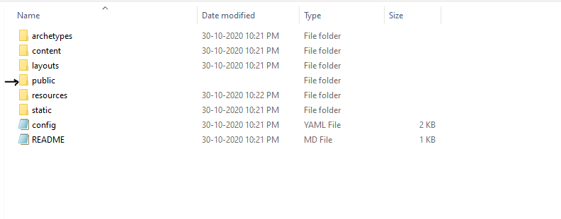
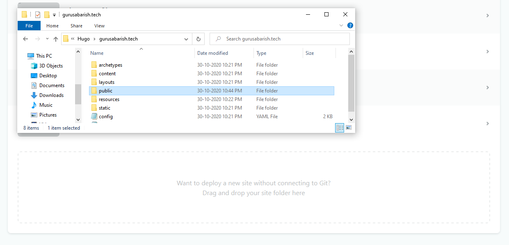
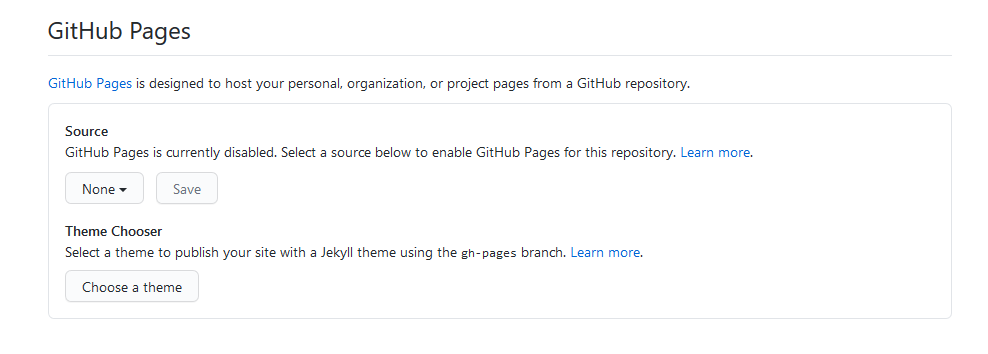
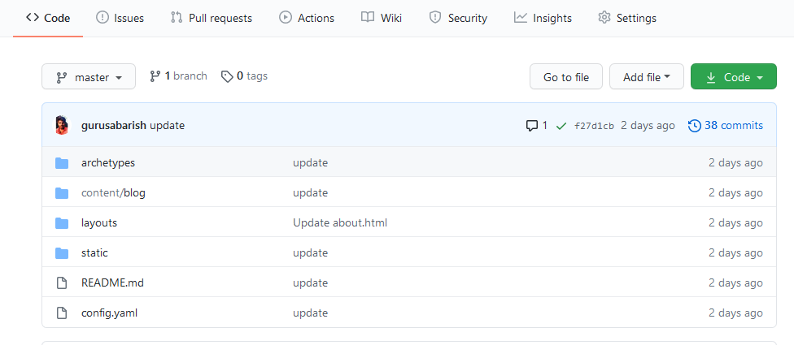
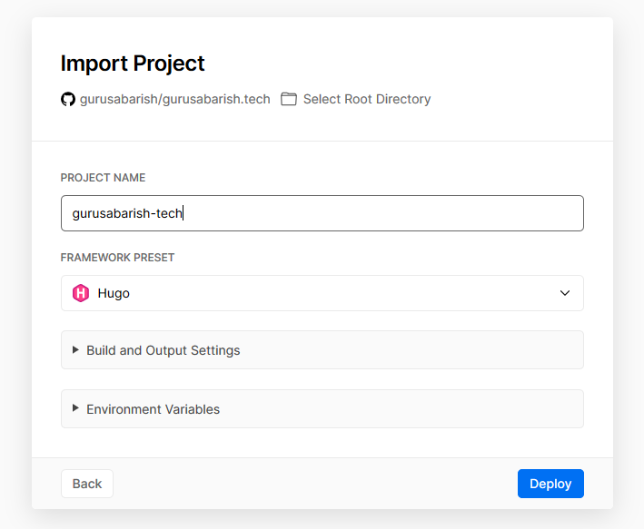

# Build your website with "Hugo" comment

Go to the terminal and type "hugo" and press enter to build website files with public folder. The public folder is used to deploy your hugo website. Now you should have a folder as the image.

<div className="Image__Small">
  
</div>

_Note: You should delete the public folder for each time before using hugo comment._

# Deploy your hugo website with Netlify

You can easily deploy your website using Netlify. There are two ways to deploy in Netlify. Here,

#### **Manual deploy:**

- In manual deploy, you should upload your website to netlify for each and every change. Lets see "how to deploy?", Now you have the public folder that has the all website files.
- Go to the [Netlify](https://netlify.com) switched to the site tap and drag and drop your public folder and Setup your [custom domain](https://docs.netlify.com/domains-https/custom-domains/) in netlify.

<div className="Image__Small">
  
</div>

#### **Deploy from github:**

- You can also use the github as your source. To use this method, you should link your github account in netlify. After connecting, you can create a website from github using the `New site from git` button.
  <div className="Image__Small">
  
</div>
- Your github repository should have the files same as the public folder. You can push the public folder files in github.
- It will automatically update your website whenever your gihub source code is modify.

## Deploy your hugo website using Github Pages

Github allows to host your static website in github with free domain ( username.github.io ). If you want to deploy your hugo website using github pages, you should have a github account and should know to [setup github pages](https://guides.github.com/features/pages/). In github, also two ways to deploy.

#### **username.github.io** repository:

- Create a repository as your username followed by github.io _(username.github.io)_
- Push your public folder files to that github repo.
<div className="Image__Small">
  
</div>

- In setting, enable the github pages.
- Now, you will get a website as your username.github.io

#### **Project repository**:

This repo looks like `username/project`. You should add [custom domain](https://docs.github.com/en/free-pro-team@latest/github/working-with-github-pages/about-custom-domains-and-github-pages) to your repo to create a website for this repository otherwise it will not work well. You can follow the same as above for further.

## Deploy without using build(_hugo_) comment

In this method, you can deploy your hugo website without using "hugo build" comment. You should have github repository to suse this method. You don't need push the public folder to github instead, Push your hole hugo website folder to your github repo. Your repo looks like below image. Here you can use two hosting companies one is Netlify and another one is Vercel.

<div className="Image__Small">
  
</div>

#### **Deploy your hugo website in Netlify without using hugo build comment**:

- Add a file in your hugo website folder called `netlify.toml` and push to your github repo that file contains the below content. For reference [this github repo](https://github.com/gurusabarish/hugo-profile)

```
[build]
publish = "public"
command = "hugo --gc --minify"

[context.production.environment]
HUGO_VERSION = "0.76.5"
HUGO_ENV = "production"
HUGO_ENABLEGITINFO = "true"

[context.split1]
command = "hugo --gc --minify --enableGitInfo"

[context.split1.environment]
HUGO_VERSION = "0.76.5"
HUGO_ENV = "production"

[context.deploy-preview]
command = "hugo --gc --minify --buildFuture -b $DEPLOY_PRIME_URL"

[context.deploy-preview.environment]
HUGO_VERSION = "0.76.5"

[context.branch-deploy]
command = "hugo --gc --minify -b $DEPLOY_PRIME_URL"

[context.branch-deploy.environment]
HUGO_VERSION = "0.76.5"

[context.next.environment]
HUGO_ENABLEGITINFO = "true"
```

- Go to your netlify account and create a website from github using the `New site from git` button.
- It will automatically update your website whenever your gihub source code is modify.

#### **Deploy your hugo website in Vercel without using hugo build comment:**

- _You don't need to add any extra files to your github repo._ Cerate a [Vercel](https://vercel.com) account
- Click the import project button and continue with github
- Paste the github repo URL
- Select the framework as hugo and click the `deploy` button.

<div className="Image__Small">
  
</div>
